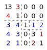

# NdCat

NdCat is a Python package that provides functionality related to Arnold's cat map in arbitrary dimensions. The cat map is a mathematical transformation that has applications in various fields such as chaos theory and cryptography.

## Background

A cat matrix is a square matrix that satisfies the following conditions:
- All elements are integers
- The determinant of the matrix is equal to 1
  
The basic 2-dimensional cat map is defined by

$$
\begin{bmatrix}
x_{n+1} \\
y_{n+1}
\end{bmatrix}=
\begin{bmatrix}
1 & 1 \\
1 & 2
\end{bmatrix}
\begin{bmatrix}
x_{n} \\
y_{n}
\end{bmatrix}
\bmod N
$$

This package can generate n-dimensional cat map using specific extension algorithms. 

## Features

1. Arnold's cat map object of arbitrary dimension.
2. Calculation of the period of the cat map.
3. Mapping of input data using the cat map.
4. Generation of random cat matrices.
5. Extension of cat matrices using different algorithms.

## Installation

You can install NdCat using pip:

pip install ndcat-0.1.tar.gz

[Download NdCat package](https://github.com/ql-aster/NdCat/releases/download/v0.1.0/ndcat-0.1.tar.gz)

## Usage

### CatMatrix

The CatMatrix class represents a cat matrix, which is a square matrix that satisfies certain conditions. Here's an example of how to use it:

```
from ndcat import CatMatrix

matrix = [[1, 1], [1, 2]]
cat_matrix = CatMatrix(matrix)

print(cat_matrix)
```

### Random Cat Matrix

The CatMatrix class provides a random method to generate random cat matrices. Here's an example of how to use it:

```
from ndcat import CatMatrix

dim = 3
cat_matrix = CatMatrix.random(dim)

print(cat_matrix)
```

### CatMap

The CatMap class represents a cat map, which is a type of cat matrix with a modulo size. It inherits from the CatMatrix class. Here's an example of how to use it:

```
from ndcat import CatMap

matrix = [[1, 1], [1, 2]]
cat_map = CatMap(matrix)

print(cat_map)

period = cat_map.period(5)
print(period)

data = [2, 3]
mapped_data = cat_map.mapping(data, 5)
print(mapped_data)
```

### Cube Coordinate Utility

The cube_coord function is a utility function that generates cube coordinates for a given dimension and size. Here's an example of how to use it:

```
from ndcat import cube_coord

dimension = 3
size = 5
coordinates = cube_coord(dimension, size)

print(coordinates)
```

## Example of Extension

1. Block Matrix Combination
```
from ndcat import CatGenerator

dim = 5
diag, off_diag = [1, 2, 3, 4], [1, 2, 3, 4, 4, 3, 2, 1]
swap_diag, swap_off_diag = [True, False], [False, True]
cat_matrix = CatGenerator.create(dim, 'block', diag, off_diag, swap_diag, swap_off_diag)

print(cat_matrix)
```
<div style="text-align: center;">
    
</div>

where red elements are from variable `diag`, blue elements are from variable `off_diag` 

2. Laplace Expansion
```
from ndcat import CatGenerator

dim = 3
dim = 3
rows, cols = [[1], [1, 2]], [[2], [3, 4]]
rows_loc, cols_loc = [0, 1], [1, 2]
cat_matrix = CatGenerator.create(dim, 'laplace', rows, cols, rows_loc, cols_loc)

print(cat_matrix)
```
$$
\begin{bmatrix}
2 & 1 & 1 \\
3 & 4 & 8 \\
1 & 1 & 2 \\
\end{bmatrix}
$$

## Extension Algorithms

NdCat provides two extension algorithms for the cat map:

1. Block Matrix Combination: This algorithm is based on the following reference:

* Zhongyun Hua et al. “Designing Hyperchaotic Cat Maps With Any Desired Number of Positive Lyapunov Exponents”. In: IEEE Transactions on Cybernetics 48.2 (Feb. 2018). Conference Name: IEEE Transactions on Cybernetics, pp. 463–473. ISSN: 2168-2275. [Read more](https://ieeexplore.ieee.org/document/7805290)

2. Laplace Expansions: This algorithm is based on the following reference:

* Y. Wu, Z. Hua, and Y. Zhou. “n-Dimensional Discrete Cat Map Generation Using Laplace Expansions”. In: IEEE Transactions on Cybernetics (2015), pp. 1–12. [Read more](https://ieeexplore.ieee.org/document/7302020)

## Contributing

Contributions to NdCat are welcome! If you have any bug reports, feature requests, or suggestions, please open an issue on the GitHub repository.

## License

NdCat is released under the MIT License.
